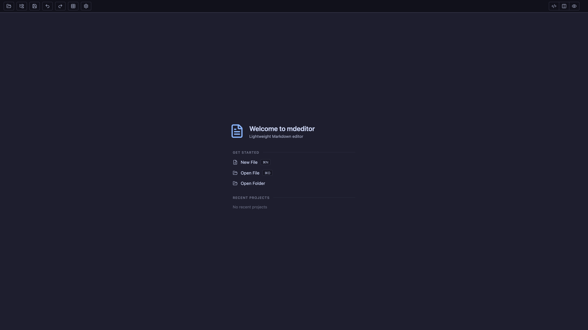

# mdeditor

[Tauri v2](https://v2.tauri.app/) で構築された高速でネイティブな Markdown エディタ。
リアルタイムプレビュー、Marp スライド、draw.io 図、サンドボックス化されたファイル
アクセスモデルを備えた軽量アプリです。

[English](README.md)



## 特徴

### エディタ

- **分割ペインのリアルタイムプレビュー**（スクロール同期、code / split / preview 切替）
- **タブ機能** — 変更マーカー付き、`Cmd/Ctrl+W` で閉じる
- **ファイルツリーサイドバー** — フォルダ記憶（起動時に最近開いたフォルダを再オープン）
- **検索 / 置換** — `Cmd/Ctrl+F`、`Cmd/Ctrl+H`
- **テーブルエディタ** — 列数・ヘッダー・アライメントを指定して挿入
- **画像の貼り付け / ドラッグ&ドロップ** — 開いているドキュメントの `images/` サブフォルダに保存
- **シンタックスハイライト**（CodeMirror 6）— Markdown, JS/TS, Python, Rust, Bash, JSON, CSS, HTML, XML, YAML, SQL, Dockerfile
- **目次（TOC）自動生成** — `h1–h3`、スムーズスクロールで見出しへ移動
- **外観カスタマイズ** — 10 種類の組み込みテーマ（Catppuccin、GitHub、Dracula、Nord、Tokyo Night、Rosé Pine、Solarized…）、エディタ / プレビューのフォントファミリ・サイズ、行間、行番号、TOC 表示
- **AI ペイン**（`Cmd/Ctrl+J`）— 開いているフォルダを cwd として `claude` / `codex` CLI を埋め込み PTY ターミナルで起動。Claude と Codex はタブで切り替え、フォルダを切り替えるとセッションは自動で再起動

### レンダリング

- **GFM Markdown**（`marked`）+ **DOMPurify** による XSS サニタイズ
- **Mermaid** 図（flowchart / sequence / ER / Gantt / class / state / pie ほか）
- **Marp** プレゼン — スライド単位の frontmatter、スコープ付きディレクティブ、`default` / `gaia` / `uncover` 組み込みテーマ、`</style>` エスケープ / `@import` ブロック
- **draw.io** (`.drawio`) — `mxGraphModel` を外部ランタイム無しで インライン SVG 描画（rect / ellipse / rhombus / edges / text）
- **CSV / TSV** ビューア — クォート付きフィールド対応
- **SVG / HTML / PDF / DOCX / 画像** のプレビュー
- **コードブロック**のシンタックスハイライト（highlight.js）

### デスクトップ統合

- **キーボードショートカット** — `Cmd/Ctrl+O` ファイルを開く、`Cmd/Ctrl+Shift+O` フォルダを開く、`Cmd/Ctrl+S` 保存、`Cmd/Ctrl+W` タブを閉じる、`Cmd/Ctrl+B` ファイルツリーの開閉、`Cmd/Ctrl+J` AI ペインの開閉、`Cmd+1…9` 最近のフォルダを開く
- **macOS ネイティブメニュー**（About / Check for Updates / Edit / Hide…）
- **自動アップデータ** — 起動時バックグラウンドチェック、メニュー / 設定から手動確認
- **状態の永続化** — 最後のフォルダ、最近のフォルダ、ウィンドウ位置、テーマ、フォント設定

## セキュリティモデル

- ファイルシステムアクセスは Rust 側のホワイトリストで **サンドボックス化**。
  ネイティブの開く / 保存ダイアログでユーザーが選択したパス、もしくはユーザー
  が選択したフォルダ配下のパスのみ読み書き可能
- **システムディレクトリのブロック**: `/etc`, `/var`, `/usr`, `/sys`, `/proc`,
  `/bin`, `/sbin`, `/boot`、macOS の `/private/*` シンボリックリンクおよび
  `/Library`。パス中のセンシティブなコンポーネント
  （`.ssh`, `.gnupg`, `.aws`, `.kube`, `.docker`, `.config/gcloud`, `Keychains`）
  は大文字小文字を区別せず、canonicalize 後にも検査してシンボリックリンク
  バイパスを防止
- **アトミックな書き込み** — 一時ファイル（PID + ナノ秒サフィックス）に書き
  込んでから rename。クラッシュしても書きかけのファイルが残らない
- **10 MB の読み書きサイズ上限**（全 IPC コマンド）
- **CSP** でスクリプトを `'self'` に制限、画像 / フォントは `data:` のみ許可、
  外部への `connect-src` は Tauri の IPC チャネル以外ブロック
- **DOMPurify** で全ての Markdown / Marp / CSV HTML 出力をサニタイズしてから DOM へ反映
- **AI ペインの PTY** は起動できるツール名を `claude` / `codex` のホワイトリスト
  に固定し、`AllowedDirs` 配下の cwd でしか spawn できない。1 回あたりの書き込み
  サイズ上限は 1 MiB。なお、起動した CLI 自体はユーザ権限で動くため、
  通常のターミナルと同じ信頼レベルで扱うこと

## 対応プラットフォーム

- macOS（Apple Silicon / Intel）
- Linux（Ubuntu 22.04+、`libwebkit2gtk-4.1` が入っている他ディストロでも動作）
- Windows

## インストール

`v*` タグごとのビルド済みバイナリは
[Releases ページ](https://github.com/r-hashi01/mdeditor/releases)で配布しています。

## 開発

### 前提条件

- [Bun](https://bun.sh/)（パッケージマネージャ兼テストランナー）
- [Rust](https://www.rust-lang.org/tools/install)（stable）
- プラットフォーム固有の Tauri 前提条件 —
  [tauri.app のドキュメント](https://v2.tauri.app/start/prerequisites/)

### よく使うコマンド

```bash
bun install            # フロントエンド依存のインストール
bun run tauri dev      # Tauri デスクトップアプリを起動（Rust + WebView）
bun run dev            # フロントエンドのみの dev サーバ (http://localhost:5173)
bun run build          # プロダクション用フロントエンドビルド
bun run tauri build    # プラットフォーム向けリリースインストーラを生成
bun run clean          # dist/ と Rust ビルド成果物を削除
```

### テスト

```bash
bun run test                  # Vitest — フロントエンドのユニットテスト
bun run test:watch            # Vitest ウォッチモード
cd src-tauri && cargo test    # Rust ユニットテスト（パス検証 / アトミック書き込み）
```

フロントエンドテストは Vitest + happy-dom で、純粋なレンダリング / サニタイズ
ロジック（Marp, CSV, draw.io, 設定バリデータ, HTML エスケープ）を検証します。
Rust テストはセキュリティ境界（`validate_path`, `has_blocked_component`,
`starts_with_any`, `atomic_write`）をカバーしています。

## プロジェクト構成

```
src/                 TypeScript フロントエンド
  main.ts            エントリポイント — エディタ / プレビュー / タブ / ツリーの結線
  editor.ts          CodeMirror 6 のセットアップ・言語切替
  preview.ts         Markdown / Marp / CSV / 画像 / PDF / DOCX のレンダリング
  marp-renderer.ts   Marp 互換スライドレンダラ（@marp-team 依存なし）
  drawio-renderer.ts .drawio XML → インライン SVG
  csv-renderer.ts    CSV / TSV → HTML テーブル
  file-tree.ts       サイドバーのファイルツリー
  tab-manager.ts     マルチタブの状態管理
  fileio.ts          ファイル開く / 保存（IPC invoke）
  folder-io.ts       フォルダ開く / 再オープン（AllowedDirs ホワイトリスト）
  image-handler.ts   画像の貼り付け / D&D → images/ 配下に保存
  table-editor.ts    Markdown テーブル挿入ダイアログ
  settings.ts        永続化設定 + サニタイザ
  settings-modal.ts  設定 UI
  themes.ts          CodeMirror + highlight.js テーマプリセット
  update-checker.ts  手動 / 自動アップデートフロー
  welcome.ts         ウェルカム画面 / 最近のフォルダ

  ai-pane.ts         `claude` / `codex` CLI を動かす埋め込み PTY ターミナル（xterm.js）

src-tauri/src/lib.rs Rust バックエンド — IPC コマンド / パスホワイトリスト / アトミック書き込み / PTY セッション
```

## CI

- **`test.yml`** — `main` への push と PR で実行。並列 2 ジョブ
  （Vitest フロントエンド + `cargo test --lib` Rust）
- **`release.yml`** — `v*` タグで実行、macOS (aarch64 + x86_64) / Ubuntu /
  Windows のインストーラをビルドし GitHub Release に公開。
  サードパーティアクションはすべてコミット SHA で pin 済み

## 技術スタック

| レイヤ           | 技術 |
|-----------------|------|
| バックエンド      | Tauri v2, Rust |
| フロントエンド    | TypeScript, Vite 7 |
| エディタ         | CodeMirror 6 |
| プレビュー       | marked, highlight.js, DOMPurify |
| 図表             | mermaid, 独自 draw.io / Marp レンダラ |
| ドキュメント     | mammoth (DOCX) |
| パッケージ / テスト | Bun, Vitest (happy-dom), cargo test |

## ライセンス

[MIT](LICENSE)
