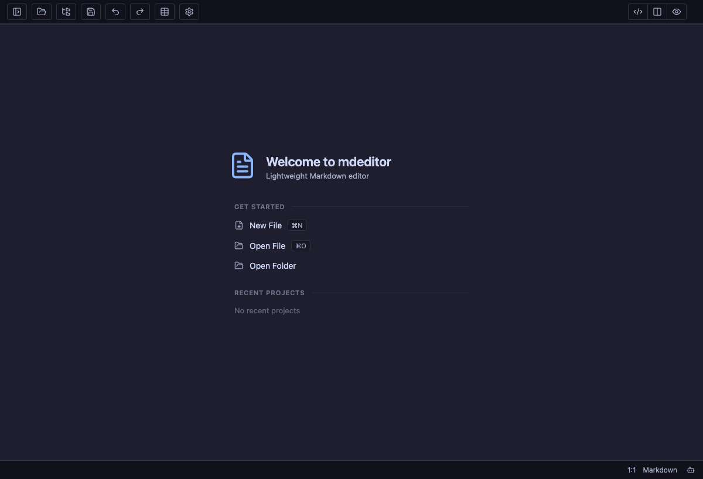
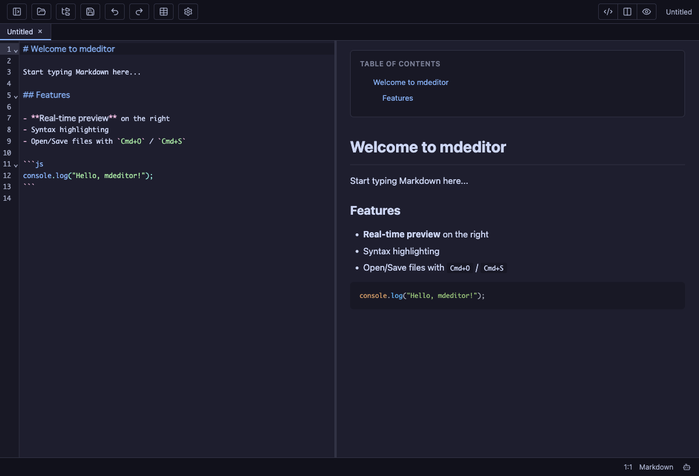
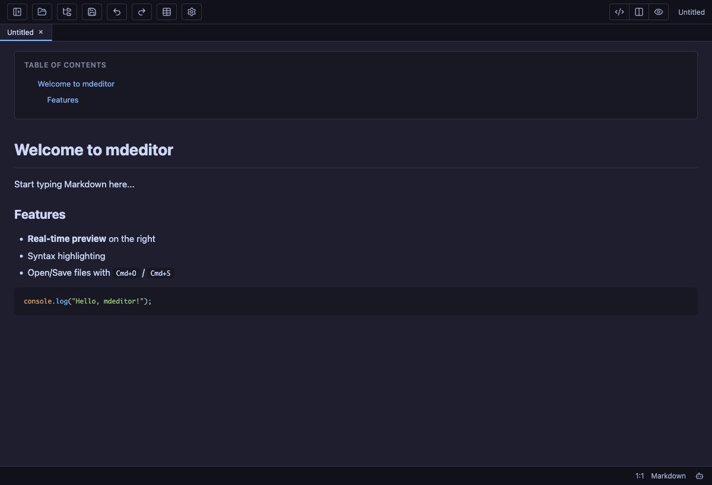
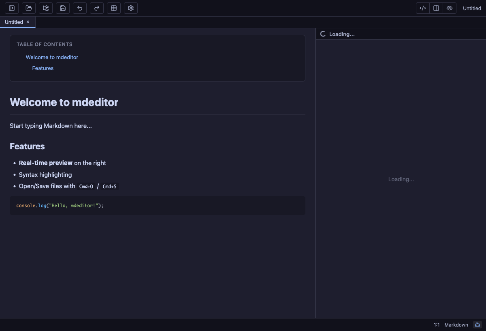

# mdeditor

[](https://github.com/r-hashi01/mdeditor/actions/workflows/test.yml)
[](https://github.com/r-hashi01/mdeditor/releases)
[](LICENSE)
[](#supported-platforms)

A fast, native Markdown editor built with [Tauri v2](https://v2.tauri.app/).

- **Small** — 4–5 MB installer on macOS / Windows / Debian. Cold start in under a second.
- **Sandboxed** — every file read and write goes through a Rust-side whitelist; system paths and secret stores (`/etc`, `.ssh`, `.aws`, …) are blocked.
- **AI-native** — run the `claude` or `codex` CLI in an embedded PTY terminal rooted at the open folder, without leaving the editor.

[日本語版はこちら](README.ja.md) · [Changelog](CHANGELOG.md) · [Architecture](docs/ARCHITECTURE.md) · [Security policy](SECURITY.md) · [Contributing](CONTRIBUTING.md)

## Screenshots

| | |
|---|---|
|  |  |
|  |  |

## Features

### Editor

- **Split-pane live preview** with synchronized scrolling (code / split / preview modes)
- **Tabs** with dirty-state tracking, `Cmd/Ctrl+W` to close
- **File tree sidebar** with folder memory (reopen recent folders on startup)
- **Search / replace** (`Cmd/Ctrl+F`, `Cmd/Ctrl+H`)
- **Table editor** — dialog-driven insert with column count, headers, alignment
- **Image paste / drag-and-drop** — saved into an `images/` subfolder of the open document
- **Markdown-aware syntax highlighting** via CodeMirror 6 — Markdown, JS/TS, Python, Rust, Bash, JSON, CSS, HTML, XML, YAML, SQL, Dockerfile
- **Table of contents** auto-generated from `h1–h3`, smooth-scroll navigation
- **Configurable appearance** — 10 built-in themes (Catppuccin, GitHub, Dracula, Nord, Tokyo Night, Rosé Pine, Solarized…), editor / preview font family and size, line height, line numbers, TOC visibility
- **AI pane** (`Cmd/Ctrl+J`) — run `claude` or `codex` CLI inside an embedded PTY terminal, rooted at the open folder. Claude and Codex live in separate tabs; sessions restart automatically when you switch folders

### Rendering

- **GFM Markdown** via `marked` + **XSS sanitization** via DOMPurify
- **Mermaid** diagrams (flowchart, sequence, ER, Gantt, class, state, pie, and more)
- **Marp** presentations — slide-aware frontmatter, per-slide scoped directives, built-in `default` / `gaia` / `uncover` themes, `<style>`-escape & `@import` blocking
- **draw.io** (`.drawio`) — inline SVG rendering of `mxGraphModel` (rect / ellipse / rhombus / edges / text) without an external runtime
- **CSV / TSV** viewer with quoted-field parsing
- **SVG / HTML / PDF / DOCX / images** preview
- **Code block syntax highlighting** in the preview via highlight.js

### Desktop integration

- **Keyboard shortcuts** — `Cmd/Ctrl+O` open file, `Cmd/Ctrl+Shift+O` open folder, `Cmd/Ctrl+S` save, `Cmd/Ctrl+W` close tab, `Cmd/Ctrl+B` toggle file tree, `Cmd/Ctrl+J` toggle AI pane, `Cmd+1…9` open recent folder
- **Native macOS menu** (About / Check for Updates / Edit / Hide…)
- **Auto-updater** — background check on launch and manual "Check for Updates" from menu / settings, verified with minisign-signed artifacts
- **Remembers** last opened folder, recent folders, window position, theme, font settings

## Supported platforms

| OS | Installer | Size |
|---|---|---|
| macOS (Apple Silicon) | `.dmg`, `.app.tar.gz` | ~4.5 MB |
| macOS (Intel) | `.dmg`, `.app.tar.gz` | ~4.7 MB |
| Windows x64 | `.exe` NSIS / `.msi` | 3.8 – 4.7 MB |
| Debian / Ubuntu (22.04+) | `.deb` | ~4.6 MB |
| Other Linux | `.AppImage` (~82 MB, bundles deps), `.rpm` | — |

Other distros likely work with `libwebkit2gtk-4.1` installed.

## Installation

### Users

Pre-built binaries are published on every `v*` tag at the [Releases page](https://github.com/r-hashi01/mdeditor/releases). Pick the artifact matching your platform.

#### macOS

The app is **not notarized** (OSS project, no paid developer certificate). On first launch macOS Gatekeeper will refuse to open it. Right-click → **Open** → **Open** from the confirmation dialog, or run once:

```bash
xattr -dr com.apple.quarantine /Applications/mdeditor.app
```

Auto-update artifacts are signed with minisign; the embedded public key rejects unsigned or tampered release bundles.

#### Linux

`.deb` / `.rpm` install system-wide. `.AppImage` is portable — `chmod +x` and run. GTK + WebKit2GTK 4.1 required.

#### Windows

`.exe` (NSIS) is recommended for most users; `.msi` is suitable for managed environments.

### Developers

If you want to run from source, install [Bun](https://bun.sh/), [Rust](https://www.rust-lang.org/tools/install), and the platform-specific [Tauri prerequisites](https://v2.tauri.app/start/prerequisites/), then run:

```bash
bun install
bun run tauri dev
```

Use `bun run dev` if you only want the browser-side Vite app.

## Security model

mdeditor is designed so that opening a hostile Markdown / HTML / Marp document cannot read secret files or escape the user-selected folder. Highlights:

- **Path sandbox** — every IPC command validates paths against an in-process whitelist populated from native open/save dialogs. System dirs (`/etc`, `/var`, `/usr`, `/sys`, `/Library`) and secret components anywhere in the path (`.ssh`, `.gnupg`, `.aws`, `.kube`, `.docker`, `Keychains`, …) are rejected case-insensitively after canonicalization to defeat symlink bypass.
- **Atomic writes** (temp-file + rename, PID + ns suffix) so crashes never leave half-written files.
- **Size caps** — 10 MB read/write ceiling on every IPC command, enforced with bounded reads (`File::take`) to defeat TOCTOU grow-after-check.
- **Strict CSP** — scripts locked to `'self'`, `data:` images/fonts only, no external `connect-src` other than Tauri's IPC.
- **HTML preview iframe** — fully sandboxed (no `allow-scripts`) + `script-src 'none'` CSP. Viewing hostile `.html` cannot execute JS.
- **DOMPurify** sanitizes every Markdown / Marp / CSV HTML output before it reaches the DOM.
- **AI pane (ACP)** — `fs/read_text_file` and `fs/write_text_file` from `claude-agent-acp` / `codex-acp` are validated against the same whitelist; tool-permission requests for shell `execute` are denied by default. Write targets are re-canonicalized post-write to catch symlink escapes.
- **PTY allowlist** — only `claude` and `codex` binaries can spawn, resolved from a fixed list of trusted install dirs (Homebrew, `/usr/local/bin`, `~/.cargo/bin`, …), never `$PATH`.
- **Signed auto-updates** — minisign public key embedded at build time; tampered updates are rejected.

Full threat model and reporting policy: [SECURITY.md](SECURITY.md).

## Development

### Prerequisites

- [Bun](https://bun.sh/) (package manager + test runner)
- [Rust](https://www.rust-lang.org/tools/install) (stable toolchain)
- Platform-specific Tauri prerequisites — [tauri.app docs](https://v2.tauri.app/start/prerequisites/)

### Common tasks

```bash
bun install            # install frontend deps
bun run tauri dev      # launch the Tauri desktop app (Rust + WebView)
bun run dev            # frontend-only dev server (http://localhost:5173)
bun run build          # production frontend build
bun run tauri build    # bundle a release installer for the current platform
bun run clean          # remove dist/ and Rust build artifacts
```

### Tests

```bash
bun run test                  # Vitest — frontend unit tests
bun run test:watch            # Vitest watch mode
cd src-tauri && cargo test    # Rust unit tests (path validation, atomic write)
```

Frontend tests use Vitest with happy-dom; they cover the pure rendering / sanitization logic (Marp, CSV, draw.io, settings validator, HTML escaping). Rust tests focus on the security boundary (`validate_path`, `has_blocked_component`, `starts_with_any`, `atomic_write`).

### Project structure

See [docs/ARCHITECTURE.md](docs/ARCHITECTURE.md) for a tour of the Rust / TypeScript boundary, the path sandbox, and the ACP AI-pane pipeline.

## Versioning

The user-facing version lives in a single place: **`package.json`**. `src-tauri/tauri.conf.json` references it via `"version": "../package.json"`, and the Rust layer reads it at runtime through `AppHandle::package_info()`. The crate-level `src-tauri/Cargo.toml` version is a placeholder (`0.0.0`) and is not displayed anywhere.

To cut a release, bump the version in `package.json` and tag `v<version>` — `release.yml` handles the rest.

## CI

- **`test.yml`** — runs on every push to `main` and every PR. Two parallel jobs: Vitest (frontend) + `cargo test --lib` (Rust, matrix: Ubuntu + macOS).
- **`release.yml`** — runs on `v*` tags, builds macOS (aarch64 + x86_64), Ubuntu, Windows installers and publishes them as a GitHub Release. All third-party actions are pinned to commit SHAs.

## Roadmap

- Continue tightening the sandbox and ACP / PTY boundaries as new file types land.
- Add more preview polish for document-heavy workflows, especially around large folders and mixed media.
- Keep packaging and release checks predictable so users can trust the published installers.

## Tech stack

| Layer         | Technology |
|---------------|-----------|
| Backend       | Tauri v2, Rust |
| Frontend      | TypeScript, Vite 7 |
| Editor        | CodeMirror 6 |
| Preview       | marked, highlight.js, DOMPurify |
| Diagrams      | mermaid, custom draw.io / Marp renderers |
| Documents     | mammoth (DOCX) |
| Package / test | Bun, Vitest (happy-dom), cargo test |

## Contributing

Issues, discussions, and PRs are welcome. Read [CONTRIBUTING.md](CONTRIBUTING.md) for setup, commit conventions, and the PR checklist. By participating you agree to the [Code of Conduct](CODE_OF_CONDUCT.md).

Reporting a security vulnerability? Don't open a public issue — see [SECURITY.md](SECURITY.md).

## License

[MIT](LICENSE)
