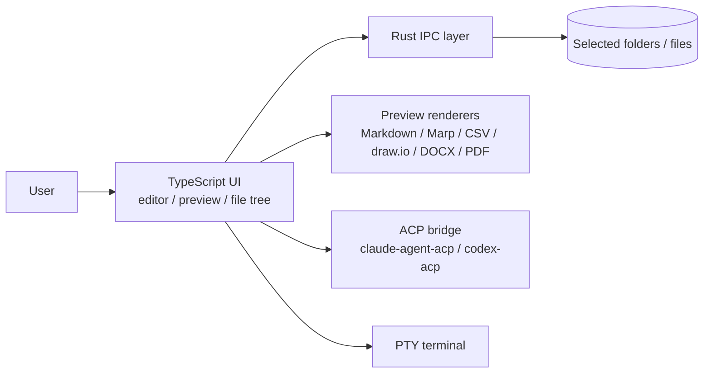
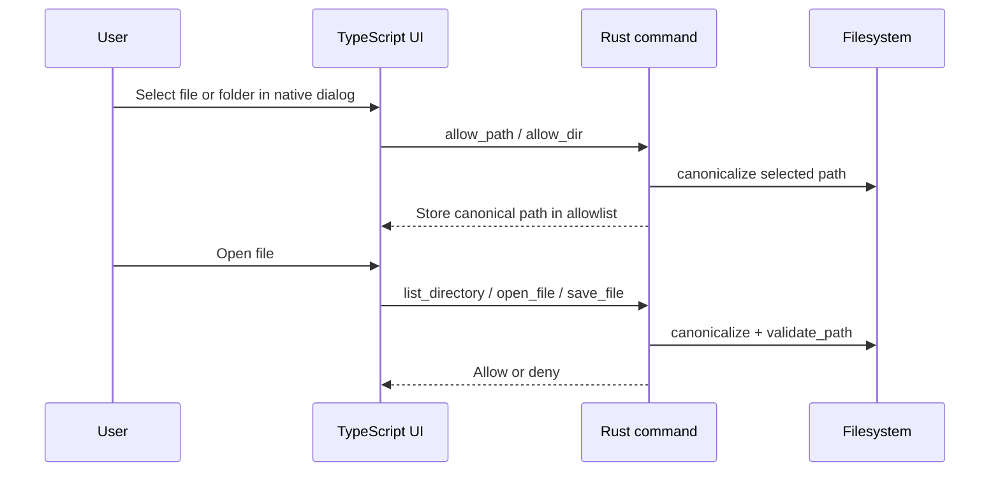
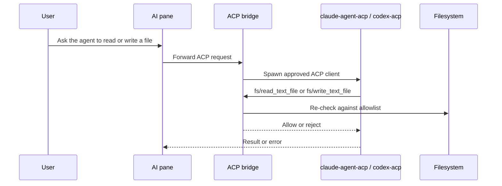
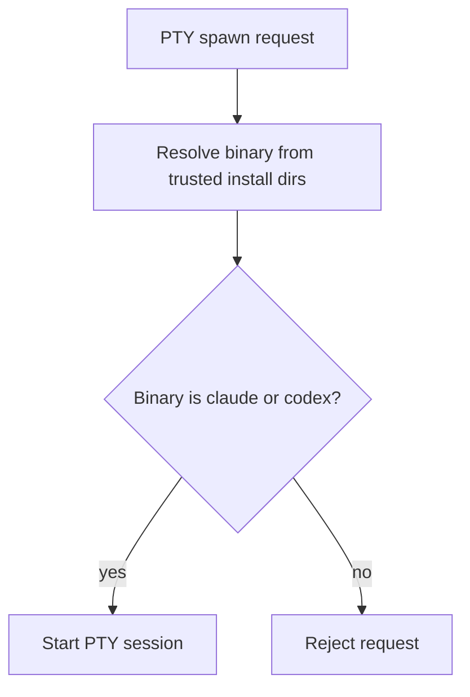

# Architecture

mdeditor is split into a TypeScript UI layer, a Rust security layer, and two controlled execution paths for AI-assisted work:

- The UI owns editor state, rendering, and local interactions.
- Rust owns every filesystem decision and all ACP / PTY process boundaries.
- The AI pane is not a general shell. It only opens `claude` or `codex` through a fixed allowlist.

## System Overview

## Sandbox Boundary

Every read and write goes through a whitelist built from native file and folder dialogs. That whitelist is enforced again after canonicalization so symlink tricks do not bypass the user-selected root.

What that means in practice:

- System paths such as `/etc`, `/var`, `/usr`, `/sys`, and `/Library` are blocked.
- Secret-bearing path components such as `.ssh`, `.gnupg`, `.aws`, `.kube`, `.docker`, and `Keychains` are rejected case-insensitively.
- Writes are atomic: data is written to a sibling temp file and then renamed into place.
- File and directory access is capped at 10 MB per IPC command.

## ACP Pipeline

The AI pane uses Agent Client Protocol processes for `claude` and `codex`, but the protocol is still constrained by the same path rules as the desktop app.

Rules worth calling out:

- `fs/read_text_file` and `fs/write_text_file` must pass the same allowlist used by Tauri commands.
- Write targets are re-canonicalized after the write to catch symlink escapes.
- Tool permission requests for shell execution are denied by default.

## PTY Allowlist

The PTY terminal is intentionally narrow. It is for the integrated CLI workflow, not arbitrary process execution.

Implementation details:

- Only `claude` and `codex` can be spawned.
- Resolution uses fixed trusted install locations such as Homebrew, `/usr/local/bin`, and `~/.cargo/bin`.
- `$PATH` is not used to discover the executable.

## Notes

- The preview pipeline is pure rendering logic where possible, which keeps the UI testable with Vitest.
- The Rust layer is the source of truth for security-sensitive behavior.
- If you need to change a boundary here, update the relevant tests at the same time.
